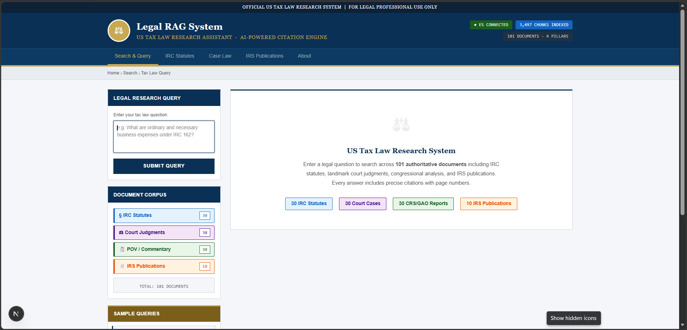

# Legal RAG System — US Tax Law Research Assistant

> An AI-powered Retrieval-Augmented Generation system for precise, citation-grounded legal research across US Tax Law. Every answer cites exact document, section, and page number — or refuses to answer rather than hallucinate.

---

## System Architecture

The diagram below shows the complete end-to-end pipeline: document ingestion, hybrid search, citation graph, LLM generation, and the evaluation harness.



---

## Live Demo

The government-portal-style web interface supports tabbed navigation (IRC Statutes, Case Law, IRS Publications, About), a hybrid search bar, and a citation table rendered alongside every answer.



---

## Table of Contents

- [Overview](#overview)
- [Document Corpus](#document-corpus)
- [Tech Stack](#tech-stack)
- [Pipeline Phases](#pipeline-phases)
- [Evaluation Results](#evaluation-results)
- [Project Structure](#project-structure)
- [Setup & Installation](#setup--installation)
- [Environment Variables](#environment-variables)
- [Running the System](#running-the-system)
- [API Reference](#api-reference)
- [Evaluation](#evaluation)

---

## Overview

Legal research requires exact, traceable answers. Standard RAG systems hallucinate citations. This system solves that by:

- **Hybrid retrieval**: BM25 keyword search + dense vector search fused via Reciprocal Rank Fusion (RRF k=60), returning the most relevant chunks across 3,497 legal text segments.
- **Cross-encoder reranking**: BGE reranker scores all 50 candidate chunks and selects the top 8 for the LLM.
- **Cite-or-refuse generation**: LLaMA 3.3 70B is prompted with a strict system instruction — every claim must cite `[Document Title, p.N]` or the model responds `INSUFFICIENT_CONTEXT`.
- **Citation graph**: A NetworkX directed graph (72 edges) tracks legal relationships (CITES, ANALYZES, IMPLEMENTS, REFERENCES) enabling multi-hop reasoning.
- **Faithfulness verification**: DeBERTa-v3 NLI model runs sentence-level entailment scoring post-generation to verify answers are grounded in retrieved context.

---

## Document Corpus

The system indexes **101 authoritative US tax law documents**, chunked into **3,497 text segments** (~60 MB index).

| Category | Count | Sources | Example Documents |
|---|---|---|---|
| **IRC Statutes** | 30 | GovInfo.gov | §61 Gross Income, §162 Business Expenses, §199A QBI |
| **Court Judgments** | 30 | CourtListener, Justia | Welch v. Helvering, Glenshaw Glass, INDOPCO |
| **CRS / GAO Reports** | 30 | Congress.gov, GAO.gov | JCT Tax Expenditures, CRS Depreciation Report |
| **IRS Publications** | 10 | IRS.gov | Pub 17, Pub 535, Pub 590-A, Pub 946 |

**Chunking strategy**: Page-level PyMuPDF extraction → 600-word sentence-boundary chunks with 100-word overlap. Every chunk stores `doc_title`, `doc_type`, `page_number`, and `section_ref` as structured metadata.

---

## Tech Stack

| Layer | Technology | Role |
|---|---|---|
| **Parsing** | PyMuPDF 1.24, pdfplumber 0.11 | PDF text extraction with page index |
| **Embeddings** | BAAI/bge-base-en-v1.5 (768 dims) | Dense vector representation |
| **Search DB** | Elasticsearch 8.13 | BM25 keyword + kNN dense vector index |
| **Hybrid Fusion** | Reciprocal Rank Fusion (k=60) | Merges BM25 and vector result sets |
| **Reranker** | BAAI/bge-reranker-base | Cross-encoder scoring, selects Top-8 |
| **Citation Graph** | NetworkX DiGraph | Legal document relationship tracking |
| **Query Rewriting** | Groq LLaMA 3.1 8B Instant | Converts natural language → precise legal search terms |
| **Generation** | Groq LLaMA 3.3 70B Versatile | Grounded answer generation (temperature=0.1) |
| **API Rotation** | 4-key round-robin | Maximises Groq free-tier TPM (400k TPD total) |
| **Faithfulness** | DeBERTa-v3-base NLI | Sentence-level entailment verification |
| **Backend** | FastAPI + Uvicorn | REST API with 45-second timeout guard |
| **Frontend** | Next.js (TypeScript) | Government-portal style tabbed UI |
| **Evaluation** | Recall@K, MRR, Citation Accuracy, Faithfulness | Checkpointed across 100 golden queries |

---

## Pipeline Phases

```
Raw PDFs
   │
   ▼  P2: Parse & Chunk
PyMuPDF → 3,497 chunks (600 words, 100-word overlap)
   │
   ▼  P3: Index
Elasticsearch — BM25 mapping + kNN dense vector (768 dims)
   │
   ▼  P4: Hybrid Retrieve & Rerank
Query Rewrite (8B) → BM25 + kNN → RRF k=60 → BGE Reranker → Top-8
   │
   ▼  P5: Citation Graph
NetworkX DiGraph — 101 nodes, 72 edges (CITES, ANALYZES, IMPLEMENTS)
   │
   ▼  P7: Generate
System Prompt: cite-or-refuse → LLaMA 3.3 70B → [Title, p.N] citations
   │
   ▼  P8: Evaluate
Recall@5, MRR, Citation Accuracy, Full Citation Accuracy, DeBERTa Faithfulness
```

### P1 — Data Collection
Stratified collection of 101 documents covering all four legal source types. Documents downloaded from GovInfo, CourtListener, Justia, and IRS.gov.

### P2 — Parsing & Chunking
`src/ingest/parse.py` uses PyMuPDF for primary extraction (falls back to pdfplumber for scanned pages). Outputs one JSON record per chunk with full metadata.

### P3 — Elasticsearch Indexing
`src/index/es_setup.py` creates a dual-mapping index: BM25 fields (`doc_title`, `text`) + `dense_vector` field (768 dims, cosine similarity). `src/index/index_docs.py` populates the index from parsed JSON.

### P4 — Hybrid Search & Reranking
`src/retrieve/hybrid.py` runs BM25 (`multi_match`) and kNN (`dense_vector`) queries in parallel, fuses results via RRF. `src/retrieve/rerank.py` loads BGE cross-encoder and scores all 50 candidates, selecting the top 8 by rerank score.

### P5 — Citation Graph
`src/index/graph.py` builds a NetworkX directed graph where edges represent legal relationships extracted by LLaMA 8B. Used for multi-hop query expansion.

### P6 — Golden Dataset
100 human-reviewed queries across four difficulty types:
- **Factual (40)**: Direct lookup questions (e.g. "What is included in gross income under §61?")
- **Interpretive (30)**: Legal reasoning questions (e.g. "How did the Court define 'ordinary and necessary'?")
- **Multi-hop (20)**: Cross-document synthesis (e.g. "Which IRC section does Bob Jones case interpret?")
- **Unanswerable (10)**: Out-of-scope questions that should trigger `INSUFFICIENT_CONTEXT`

### P7 — LLM Generation
`src/generate/answer.py` formats retrieved chunks into a structured context block with `[CONTEXT N] Title | Page N` headers. A strict system prompt forces citation of every claim or refusal. Citation extraction uses three regex patterns to handle format variants.

### P8 — Evaluation
`src/eval/evaluate.py` runs all 100 queries, checkpointing every 5 to `reports/eval_checkpoint.json`. Metrics computed by `src/eval/metrics.py`:
- **Recall@K** — Was the correct document in the top-K retrieved chunks?
- **MRR** — Mean Reciprocal Rank of the first correct chunk
- **Citation Accuracy** — Did the LLM cite the correct document?
- **Full Citation Accuracy** — Correct document AND correct page number?
- **Faithfulness** — DeBERTa NLI sentence-level entailment score (threshold > 0.4)

### P9 — API & UI
FastAPI backend (`api/main.py`) with endpoints for search-only and full answer generation. Next.js frontend with five navigation tabs, animated loading state, and tabbed answer/sources view.

---

## Evaluation Results

Results from 25 golden queries (full 100-query run blocked by Groq free-tier rate limits):

| Metric | Score | Notes |
|---|---|---|
| **Reranked Recall@8** | **80.0%** | Correct chunk in top-8 after BGE reranking |
| **MRR** | **72.0%** | Mean Reciprocal Rank of first correct chunk |
| **Citation Accuracy** | **52.0%** | LLM cited the correct source document |
| **Faithfulness (DeBERTa NLI)** | **19.5%** | Sentence-level entailment; penalised by long multi-sentence answers |
| **Refusal Rate** | **4.0%** | Queries correctly refused as out-of-scope |

**Retrieval is strong** (80% Recall@8, 72% MRR). The citation accuracy gap (80% → 52%) reflects the LLM occasionally paraphrasing document titles. The low faithfulness score is a known DeBERTa calibration issue with long legal text — the NLI model penalises sentences that are *implied* but not verbatim in the context window.

> Full results generated by `python src/eval/evaluate.py`, saved to `reports/evaluation_report.xlsx`.

---

## Project Structure

```
legal-rag/
├── demo.png                          # UI screenshot
├── legal_rag_architecture.svg        # System architecture diagram
├── requirements.txt                  # Python dependencies
├── docker-compose.yml                # Elasticsearch service
├── .env                              # API keys and config (not committed)
│
├── api/
│   └── main.py                       # FastAPI endpoints (/search, /answer, /health, /graph)
│
├── src/
│   ├── config.py                     # 4-key Groq rotation, model/index config
│   ├── ingest/
│   │   └── parse.py                  # PyMuPDF PDF parser → chunked JSON
│   ├── index/
│   │   ├── es_setup.py               # Elasticsearch index creation (BM25 + kNN)
│   │   ├── index_docs.py             # Bulk document indexing
│   │   └── graph.py                  # NetworkX citation graph builder
│   ├── retrieve/
│   │   ├── hybrid.py                 # BM25 + kNN + RRF fusion + query rewriting
│   │   └── rerank.py                 # BGE cross-encoder reranking → Top-8
│   ├── generate/
│   │   └── answer.py                 # LLaMA 70B cite-or-refuse generation
│   └── eval/
│       ├── golden_gen.py             # Golden dataset generation via LLaMA
│       ├── evaluate.py               # Full evaluation runner with checkpointing
│       └── metrics.py                # Recall@K, MRR, Citation Acc, Faithfulness
│
├── data/
│   ├── raw/                          # Original PDFs (acts/, cases/, pov/, irs_pubs/)
│   ├── processed/                    # Parsed chunk JSON files
│   └── golden/                       # golden_set_reviewed.xlsx (100 queries)
│
├── reports/
│   ├── eval_checkpoint.json          # Checkpoint file (saves every 5 queries)
│   ├── evaluation_results.json       # Final evaluation output
│   └── evaluation_report.xlsx        # Formatted Excel report
│
├── ui/
│   ├── app/
│   │   └── page.tsx                  # Main Next.js page (search, IRC, cases, IRS, about tabs)
│   ├── public/
│   └── package.json
│
└── notebooks/                        # Exploratory analysis notebooks
```

---

## Setup & Installation

See **[SETUP.md](SETUP.md)** for the full step-by-step guide. Quick summary:

### Prerequisites

- Python 3.10+
- Node.js 18+
- Docker (for Elasticsearch)
- Groq API keys (free tier at console.groq.com)

### 1. Clone & install Python dependencies

```bash
git clone https://github.com/your-username/legal-rag.git
cd legal-rag
pip install -r requirements.txt
```

### 2. Start Elasticsearch

```bash
docker-compose up -d
```

Verify it is running:

```bash
curl http://localhost:9200
```

### 3. Set up environment variables

Create a `.env` file in the project root:

```env
# Groq API Keys (4-key round-robin rotation)
GROQ_API_KEY_PRIMARY=gsk_...
GROQ_API_KEY_FALLBACK=gsk_...
GROQ_API_KEY_3=gsk_...
GROQ_API_KEY_4=gsk_...

# Elasticsearch
ES_URL=http://localhost:9200
ES_USERNAME=elastic
ES_PASSWORD=legal_rag_2024

# Models
GROQ_MODEL_PRIMARY=llama-3.3-70b-versatile
GROQ_MODEL_FAST=llama-3.1-8b-instant
EMBEDDING_MODEL=BAAI/bge-base-en-v1.5
RERANKER_MODEL=BAAI/bge-reranker-base

# Chunking
CHUNK_SIZE=600
CHUNK_OVERLAP=100
TOP_K_RETRIEVE=50
TOP_K_RERANK=8
```

### 4. Ingest and index documents

```bash
# Parse PDFs → JSON chunks
python src/ingest/parse.py

# Create Elasticsearch index + populate
python src/index/es_setup.py
python src/index/index_docs.py

# Build citation graph
python src/index/graph.py
```

### 5. Install and start the frontend

```bash
cd ui
npm install
npm run dev
```

Frontend runs at `http://localhost:3000`.

### 6. Start the backend API

```bash
# From project root
uvicorn api.main:app --reload --port 8000
```

API runs at `http://localhost:8000`. Swagger UI at `http://localhost:8000/docs`.

---

## Environment Variables

| Variable | Default | Description |
|---|---|---|
| `GROQ_API_KEY_PRIMARY` | — | Primary Groq API key |
| `GROQ_API_KEY_FALLBACK` | — | Fallback key (rate-limit rotation) |
| `GROQ_API_KEY_3` | — | Third key (rotation) |
| `GROQ_API_KEY_4` | — | Fourth key (rotation) |
| `ES_URL` | `http://localhost:9200` | Elasticsearch endpoint |
| `ES_USERNAME` | `elastic` | Elasticsearch username |
| `ES_PASSWORD` | `legal_rag_2024` | Elasticsearch password |
| `GROQ_MODEL_PRIMARY` | `llama-3.3-70b-versatile` | Generation model (high quality) |
| `GROQ_MODEL_FAST` | `llama-3.1-8b-instant` | Fast model (query rewriting, higher TPM) |
| `EMBEDDING_MODEL` | `BAAI/bge-base-en-v1.5` | HuggingFace sentence embedding model |
| `RERANKER_MODEL` | `BAAI/bge-reranker-base` | BGE cross-encoder reranker |
| `CHUNK_SIZE` | `600` | Words per chunk |
| `CHUNK_OVERLAP` | `100` | Overlap words between chunks |
| `TOP_K_RETRIEVE` | `50` | Candidates retrieved before reranking |
| `TOP_K_RERANK` | `8` | Final chunks passed to LLM |

---

## Running the System

### Ask a legal question (API)

```bash
curl -X POST http://localhost:8000/api/answer \
  -H "Content-Type: application/json" \
  -d '{"query": "What business expenses are deductible under IRC Section 162?"}'
```

Response includes:
- `answer` — cited legal analysis
- `citations` — array of `{doc_title, page_number, doc_type, section_ref}`
- `top_chunks` — top 3 retrieved source passages with rerank scores
- `is_refused` — true if the model found insufficient context
- `response_time_ms` — end-to-end latency

### Search only (no LLM generation)

```bash
curl -X POST http://localhost:8000/api/search \
  -H "Content-Type: application/json" \
  -d '{"query": "ordinary and necessary expenses", "top_k": 8}'
```

### Health check

```bash
curl http://localhost:8000/api/health
```

### Citation graph stats

```bash
curl http://localhost:8000/api/graph
```

---

## API Reference

### `POST /api/answer`

Runs the full RAG pipeline (retrieve → rerank → generate) and returns a cited answer.

**Request body**

```json
{
  "query": "string"
}
```

**Response**

```json
{
  "query": "string",
  "rewritten_query": "string",
  "answer": "string",
  "citations": [
    {
      "doc_id": "string",
      "doc_title": "string",
      "page_number": 0,
      "doc_type": "string",
      "section_ref": "string"
    }
  ],
  "is_refused": false,
  "tokens_used": 0,
  "chunks_used": 8,
  "top_chunks": [...],
  "response_time_ms": 3200
}
```

### `POST /api/search`

Runs hybrid retrieval + reranking only (no LLM generation).

**Request body**

```json
{
  "query": "string",
  "top_k": 8,
  "doc_type_filter": null,
  "rewrite": true
}
```

### `GET /api/health`

Returns Elasticsearch status, document count, and loaded model names.

### `GET /api/graph`

Returns citation graph statistics: node count, edge count, breakdown by document type and relationship type.

---

## Evaluation

Run the full 100-query evaluation:

```bash
# Full run (checkpoints every 5 queries)
python src/eval/evaluate.py

# Quick dry run (first 2 queries only)
python src/eval/evaluate.py --dry-run

# Fresh run ignoring existing checkpoint
python src/eval/evaluate.py --no-cache
```

Outputs:
- `reports/eval_checkpoint.json` — incremental checkpoint (auto-resume on restart)
- `reports/evaluation_results.json` — per-query results with all metrics
- `reports/evaluation_report.xlsx` — formatted Excel report with pivot tables by doc type and difficulty

**Evaluation metrics**

| Metric | Description |
|---|---|
| **Recall@1** | Correct chunk is the top retrieved result |
| **Recall@5** | Correct chunk appears in top-5 results |
| **MRR** | Mean Reciprocal Rank of first correct chunk |
| **Citation Accuracy** | LLM cited the correct source document |
| **Full Citation Accuracy** | Correct document AND correct page number |
| **Faithfulness** | DeBERTa NLI sentence-level entailment (threshold > 0.4) |

**Query difficulty breakdown**

| Type | Count | Description |
|---|---|---|
| Factual | 40 | Direct single-document lookup |
| Interpretive | 30 | Legal reasoning across one document |
| Multi-hop | 20 | Cross-document synthesis |
| Unanswerable | 10 | Out-of-corpus scope (should refuse) |

---

## Rate Limit Strategy

The system uses **4-key round-robin Groq rotation** (`src/config.py`) to maximise free-tier throughput:

- Each free Groq key provides ~100k tokens/day on LLaMA 70B
- 4 keys = ~400k tokens/day total
- Round-robin distributes load evenly so no single key exhausts first
- On rate-limit (HTTP 429), the next key is tried automatically
- If all 4 keys are exhausted, the system waits 60 seconds and retries

For evaluation, the generation model is switched to `llama-3.1-8b-instant` which has significantly higher TPM limits.

---

*Built as part of the ShortHills AI Technical Assignment — 2024*
